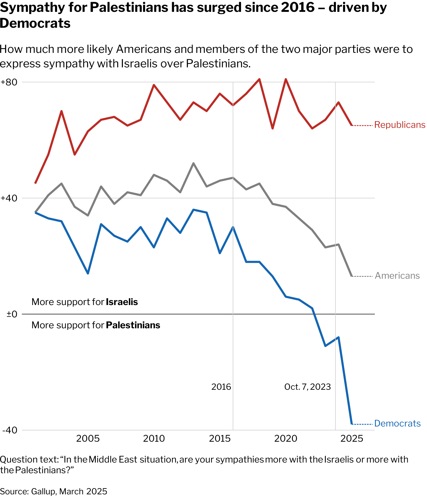

# US Sympathies Over Time

A replication of Gallup’s analysis of American sympathy toward Israelis vs. Palestinians, from 2000 through 2025. This project reads the original Gallup CSV data, computes the **sympathy difference** (Israelis − Palestinians), and produces a line‐chart styled after Gallup’s own visualization.

------------------------------------------------------------------------

## 🗂 Project Structure

```         
USsentiments/
├── data/
│   ├── Americans Sympathies.csv
│   ├── Democrats Sympathies.csv
│   └── Republicans Sympathies.csv
├── images/
│   └── israelis-palestinians.png   ← generated plot
├── plot_sympathies.R               ← main R script
└── README.md
```

-   **data/** Raw CSV exports from Gallup for each group (All Americans, Democrats, Republicans).

-   **images/** Output folder containing the final plot image.

-   **plot_sympathies.R** R script that reads, cleans, and plots the Gallup data using **tidyverse**, **showtext**, and **ggtext**.

------------------------------------------------------------------------

## 📷 Preview



------------------------------------------------------------------------

## 🚀 Getting Started

### 1. Clone the Repo

``` bash
git clone https://github.com/joseph-data/USsentiments.git
cd USsentiments
```

### 2. Install Dependencies

Run in R or RStudio:

``` r
install.packages(c("tidyverse", "showtext", "ggtext"))
```

### 3. Execute the Script

``` bash
Rscript plot_sympathies.R
```

This will:

1.  Read all `*Sympathies.csv` files in `data/`.
2.  Compute the yearly sympathy difference (`Israelis − Palestinians`).
3.  Generate and save the plot to `images/israelis-palestinians.png` (6×6.97″ at 300 dpi).

------------------------------------------------------------------------

## 📝 Walkthrough of `plot_sympathies.R`

Below is a high-level rundown of the main sections in the script.

``` r
# 1. Setup -------------------------------------------------------------------
library(tidyverse)    # data wrangling & ggplot2
library(showtext)     # custom Google fonts
library(ggtext)       # rich text in ggplot2

# 2. Font Configuration -----------------------------------------------------
font_add_google("Libre Franklin", "franklin")
showtext_opts(dpi = 300)
showtext_auto()
```

-   **Purpose**: Load required packages and register the *Libre Franklin* font for high‑res output.

``` r
# 3. Data Ingestion & Cleaning ----------------------------------------------
csv_files <- list.files("data", pattern = "Sympathies.*\\.csv$", full.names = TRUE)
gallup_data <- read_csv(csv_files, id = "party", skip = 1,
                        col_names = c("year", "israelis", "palestinians")) %>%
  mutate(
    party       = str_replace(party, "' Sympathies.*", ""),
    party       = if_else(party == "Americans", "All\nAmericans", party),
    israelis    = parse_number(israelis),
    palestinians= parse_number(palestinians),
    difference  = israelis - palestinians,
    date        = as.Date(paste0(year, "-01-01"))
  ) %>%
  select(party, date, difference)
```

-   **Purpose**: Read all three CSVs, clean labels, parse percentages, compute the difference, and prepare a date column for plotting.

``` r
# 4. Plot Construction ------------------------------------------------------
gallup_plot <- gallup_data %>%
  ggplot(aes(x = date, y = difference, color = party)) +
  geom_line(size = 1) +
  # ... (annotations, text labels, reference lines) ...
  scale_color_manual(values = c(
    Republicans    = "#BC2B24",
    `All\nAmericans` = "#494949",
    Democrats      = "#1366B3"
  )) +
  theme_minimal(base_family = "franklin")
```

-   **Purpose**: Build the time‑series line chart with custom annotations, quadrant labels, and Gallup‑style theming.

``` r
# 5. Save Output ------------------------------------------------------------
ggsave(
  filename = "images/israelis-palestinians.png",
  plot     = gallup_plot,
  width    = 6,
  height   = 6.97,
  dpi      = 300
)
```

-   **Purpose**: Export the final visualization as a high‑resolution PNG ready for publication or embedding.

------------------------------------------------------------------------

## 🔄 Next Steps

-   **Update data**: Drop in new Gallup CSVs into `data/` as they’re released.
-   **Customize**: Tweak colors, fonts, or annotations in the R script for alternate styles.
-   **Report**: Embed the plot in an RMarkdown report or dashboard.

------------------------------------------------------------------------

## ℹ️ Credits

-   **Source data**: Gallup poll, March 2025
-   **Original article**: [Less than half sympathetic toward Israelis](https://news.gallup.com/poll/657404/less-half-sympathetic-toward-israelis.aspx)
